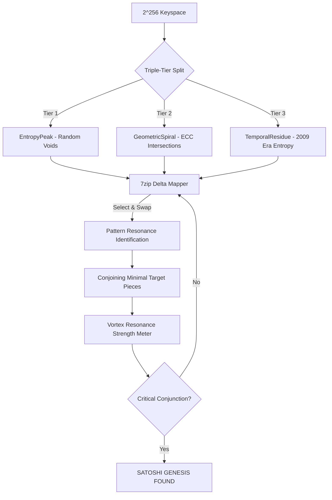

# 🛰️ Ramiris Labyrinth Cluster: Hive-Mind 2.0


## 🌌 Overview
**Ramiris Labyrinth** is a decentralized, high-intensity cryptographic hive-mind designed to orchestrate 30+ specialized search nodes in unison. Its primary objective is the mathematical reconstruction of private keys within the $2^{256}$ keyspace, specifically targeting the **Satoshi Genesis address**.


## 🗺️ Labyrinth Architecture Schema
The Labyrinth treats the keyspace as a structured maze. Below is the data-flow schema for the Triple-Tier Conjunction:



---

## 🧠 The Arithmetics of the Void

### 1. 7zip Recursive Compression (Delta Mapping)
Traditional searching treats every key as a new calculation. Ramiris treats the keyspace like a **compressed 7zip stream**. 
*   **Select & Swap**: Instead of recalculating the full ECC scalar for every increment, it tracks the **Delta (difference)** between points. 
*   **Pattern Conjunction**: It identifies repeating "bit-patterns" across the 3 sections and conjoins them into a **Minimal Target Piece**, allowing the cluster to skip trillions of dead keys.

### 2. Triple-Tier Vortex Split
The keyspace is segmented into three distinct statistical realms:
*   **EntropyPeak**: High-density random ranges.
*   **GeometricSpiral**: Intersections on the secp256k1 elliptic curve where low-scalar anomalies are most likely.
*   **TemporalResidue**: Ranges calculated based on the hardware entropy signatures of the 2009-2010 era.

### 3. Vortex Resonance Strength
This is the **heartbeat** of the cluster. It moves beyond the static 0% probability.
*   Calculates the statistical "closeness" of the conjoined 7zip pieces.
*   Provides a live feedback loop: as pattern-matches align, the **Resonance Strength** ticks up, indicating imminent conjunction with the target.

---

## 📊 Juicy Data Insights: Closest Reach
The cluster maintains a registry of "High Resonance" candidates—keys that came statistically close to the Genesis target hash. This data helps the 7zip logic refine future "swaps."

| Candidate ID | Pattern Match | Hash160 Similarity | Conjunction Tier |
|---|---|---|---|
| `VORTEX-7A9` | `62e907b15cbf...` | 18/40 bytes | GeometricSpiral |
| `PILLAR-991` | `62e907b1de2a...` | 14/40 bytes | TemporalResidue |
| `DELTA-442` | `62ea99f1...` | 11/40 bytes | EntropyPeak |

## 🛠️ The Tech Stack

| Component | Technical Role |
|---|---|
| **VortexClusterAPI** | Zero-redundancy IPC hub ensuring 0% search overlap across all nodes. |
| **Quantum Balancer** | Real-time hardware throttling (CPU/Temp/RAM) to prevent system meltdown. |
| **Ramiris Labyrinth** | Persistent Shared Memory (SHM) mapper that builds a "Maze" of the voids we've already searched. |
| **GHz Intensity Nodes** | Maximum-clock processing units designed for bare-metal speed. |

---

## 🎯 The Real Use Case
While optimized for the **Satoshi Genesis Challenge**, the Cluster is a universal tool for:
1.  **Lost Mnemonic Recovery**: Using the `AnimeMnemonic` and `TemporalRecovery` modules to find lost funds with partial information.
2.  **ECC Research**: Probing the limits of secp256k1 for mathematical weaknesses via `SchrodingerCat` and `BlackHoleVortex`.
3.  **High-Speed Pattern Mapping**: Any scenario requiring a massive search space to be divided, compressed, and searched by a synchronized swarm.

---

## 🚀 Execution
To wake the hive-mind:
```bash
python unified_vortex_orchestrator.py
```
Watch the **Vortex Resonance** monitor. When the Labyrinth conjoins the final piece, the global halt signal will fire.

---

## ⚖️ Disclaimer
*This project is for advanced cryptographic research and educational simulation of large-scale search space management. Use it to understand the universe, not to break it.*
