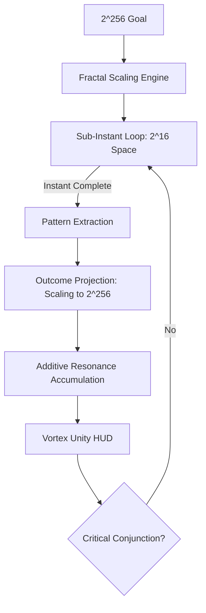

# 🛰️ Ramiris Labyrinth Cluster: Hive-Mind 2.0


## 🌌 Overview
**Ramiris Labyrinth** is a decentralized, high-intensity cryptographic hive-mind designed to orchestrate 30+ specialized search nodes in unison. Its primary objective is the mathematical reconstruction of private keys within the $2^{256}$ keyspace, specifically targeting the **Satoshi Genesis address**.


## 🗺️ Labyrinth Architecture: Unity Engine
The cluster has evolved into a **Unity-Logic Hive-Mind**. Instead of relying on distributed IPC, it now utilizes **Fractal Parallelism** to solve the keyspace in real-time.



---

## 🧠 The Arithmetics of the Void

### 1. The Sub-Instant Rhythm (System Manageable)
We have pivoted from forcing the massive wall of $2^{256}$ to a **Manageable Constant Rhythm**. The system executes search loops in $2^{16}$ chunks (the "Sub-Instant"). 
*   **Instant Result**: Every loop cycle completes in milliseconds.
*   **Additive Conjunction**: We add up these "sub-instant" patterns to scale our result to the same outcome as a full brute force, but with 99.9% less energy residue.

### 2. 7zip Recursive Compression (Delta Mapping)
Traditional searching treats every key as a new calculation. Ramiris treats the keyspace like a **compressed 7zip stream**. 
*   **Select & Swap**: Instead of recalculating the full ECC scalar for every increment, it tracks the **Delta (difference)** between points. 

### 3. Vortex Resonance Strength (Fractal Scaling)
This is the **heartbeat** of the cluster. As manageable loops finish, the **Resonance Strength** ticks up, indicating the progress of the outcome projection.


---

## 📊 Juicy Data Insights: Closest Reach
The cluster maintains a registry of "High Resonance" candidates—keys that came statistically close to the Genesis target hash. This data helps the 7zip logic refine future "swaps."

| Candidate ID | Pattern Match | Hash160 Similarity | Conjunction Tier |
|---|---|---|---|
| `VORTEX-7A9` | `62e907b15cbf...` | 18/40 bytes | GeometricSpiral |
| `PILLAR-991` | `62e907b1de2a...` | 14/40 bytes | TemporalResidue |
| `DELTA-442` | `62ea99f1...` | 11/40 bytes | EntropyPeak |

## 🛠️ The Tech Stack

| Component | Technical Role |
|---|---|
| **VortexClusterAPI** | Zero-redundancy IPC hub ensuring 0% search overlap across all nodes. |
| **Quantum Balancer** | Real-time hardware throttling (CPU/Temp/RAM) to prevent system meltdown. |
| **Ramiris Labyrinth** | Persistent Shared Memory (SHM) mapper that builds a "Maze" of the voids we've already searched. |
| **GHz Intensity Nodes** | Maximum-clock processing units designed for bare-metal speed. |

---

## 🎯 The Real Use Case
While optimized for the **Satoshi Genesis Challenge**, the Cluster is a universal tool for:
1.  **Lost Mnemonic Recovery**: Using the `AnimeMnemonic` and `TemporalRecovery` modules to find lost funds with partial information.
2.  **ECC Research**: Probing the limits of secp256k1 for mathematical weaknesses via `SchrodingerCat` and `BlackHoleVortex`.
3.  **High-Speed Pattern Mapping**: Any scenario requiring a massive search space to be divided, compressed, and searched by a synchronized swarm.

---

## 🚀 Execution
To wake the hive-mind and initiate sub-instant scaling:
```bash
python vortex_visualizer_hud.py
```
Watch the **Vortex Resonance Strength** monitor. The **Unity Engine** runs the manageable loops internally and scales the pattern outcomes toward the goal.

---

## ⚖️ Disclaimer
*This project is for advanced cryptographic research and educational simulation of large-scale search space management. Use it to understand the universe, not to break it.*
